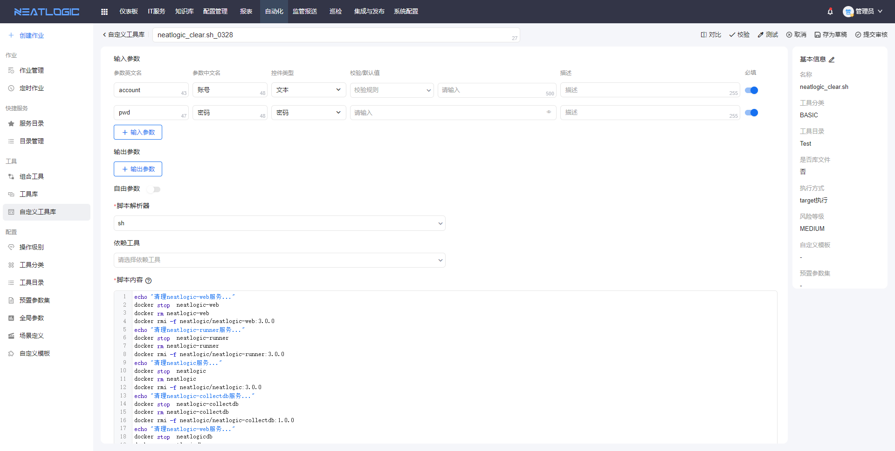
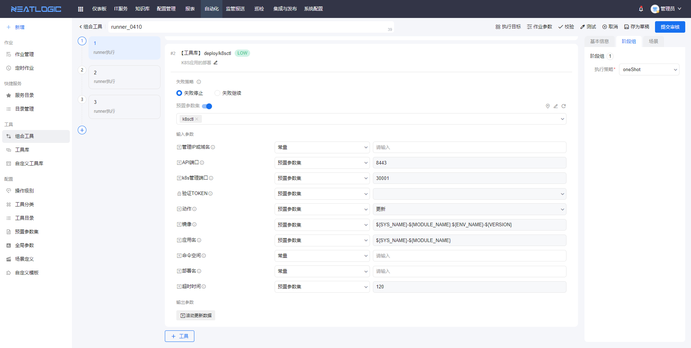

[Chinese](README.md) / English

## about

Neatlogic-autoexec is an automation management module that enables one click automated execution of scenarios through combination of code scripts, such as MySQL database installation. The module includes functions such as custom tools, combination tools, and job management.

## Feature

### Tools

Tools are divided into two types: system built tools and custom tools. The execution methods of the tools support local execution (runner) and execution on the target machine (target, runner ->target) 

A variety of script parsers are built into the custom tool, supporting commonly used script types such as python, javascript, perl, and sh, and supporting the definition of input and input parameters. Default values can be configured for parameter values.

### Combined tool

Based on a combined script of tools and custom tools, add tools to the stage and complete tool configuration by creating a stage framework.

-Support the definition of job parameters, which can be referenced by tool parameters and execution targets
-Support for preset execution goals in stages or stage groups, as well as for the entire job. Stage execution goals have a higher priority.

### Job

There are two ways to execute jobs, including manually initiating tasks and timed jobs.
1. Initiate automated jobs based on composite tools

On the job management page, you can filter target jobs based on needs and view job details

2. Timed job is achieved through a "timer+combination tool" approach.The configuration of timed jobs includes two parts: basic information and tool parameters. The combination of basic information, tools, and scheduled plans determine the script and execution time of the job. Tool parameters are preset parameters for execution, including batch quantity, execution target, execution account, and operation parameters.

### Preset parameter set

The preset parameter set can be associated with one or more tools, and the parameters merge the input parameters of the associated tools into a parameter set, supporting pre configured parameter values.

* The tool is directly associated with a preset parameter set. When combining tools to reference a tool, the tool's configuration defaults to enabling the associated preset parameter set, and the input parameter mapping value of the tool defaults to the preset parameter set configuration.
  
* The tool is not associated with a preset parameter set, When referencing a tool in combination, the tool's configuration defaults to turning off the preset parameter set. If the association preset parameter set is enabled, you can freely select the preset parameter set associated with the current tool.
  