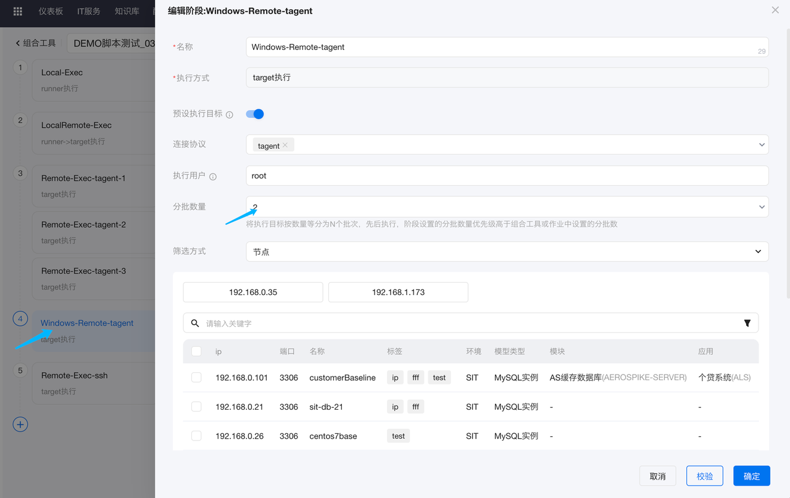
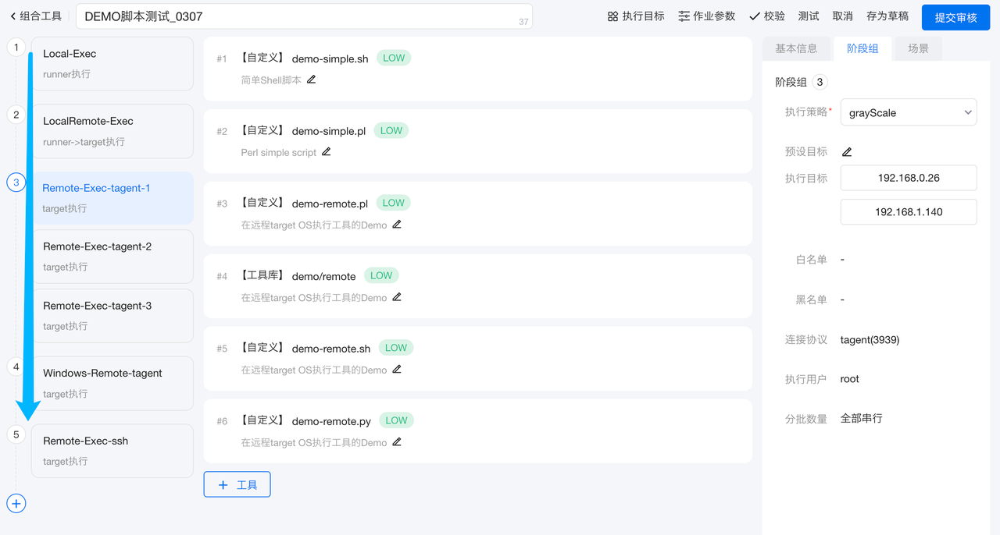
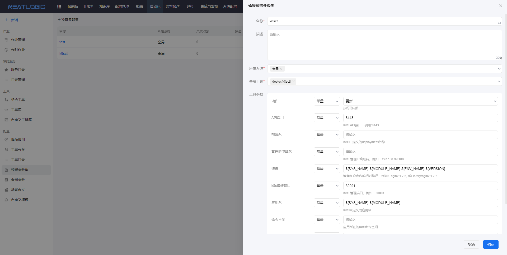

中文 / [English](README.en.md)

    

## 关于

neatlogic-autoexec自动化模块可以通过组合代码脚本实现场景一键自动化执行，例如MySQL数据库安装，模块包括自定义工具、组合工具、作业管理等功能。自动发布[neatlogic-deploy](../../../neatlogic-deploy/blob/develop3.0.0/README.md)
、巡检[neatlogic-inspect](../../../neatlogic-inspect/blob/develop3.0.0/README.md)
和配置管理[neatlogic-cmdb](../../../neatlogic-cmdb/blob/develop3.0.0/README.md)的自动发现功能，也使用了neatlogic-autoexec的基础能力。
neatlogic-autoexec不能单独部署，也不能单独构建，如需构建和部署，请参考[neatlogic-itom-all](../../../neatlogic-itom-all/blob/develop3.0.0/README.md)
的说明文档。

## 架构图

neatlogic-autoexec是自动化模块的管理平台，主要用于自动化作业的配置，执行还需要配合[neatlogic-runner](../../../neatlogic-runner/blob/develop3.0.0/README.md)
和[neatlogic-autoexec-backend](../../../neatlogic-autoexec-backend/blob/master/README.MD)
支持，[neatlogic-autoexec-scripts](../../../neatlogic-autoexec-scripts/blob/master/README.md)
则包含了大量原厂脚本，涵盖了安装数据库、复制虚拟机、灾备切换等复杂场景。

## 关键名词

### 编排（组合工具）

多个阶段组（Phase Group）串联组合成为一个编排，编排是最小的自动化发布单元，原子工具需要放入编排才可以被执行。编排中的多个阶段组顺序串联执行。

### 阶段组（Phase Group）

多个阶段（Stage）并联组合成为一个阶段组，一个阶段组包含多个阶段，这多个阶段可以并行执行（oneshot
exectuing），也可以多个执行目标节点分批依次执行（gray scale executing），每批节点依次执行完阶段组内的阶段后再启动另外一批节点继续依次执行阶段组内的各个阶段。

### 阶段（Phase）

多个原子工具（Atom tool）串联组合成为一个阶段，同一阶段的多个原子工具按照编排顺序执行。如果一个阶段设置多个执行目标节点，多个目标节点支持分多批执行。原子工具在同一个节点顺序执行。

### 原子工具（Tool）

单个原子工具类似单独开发的命令行工具，可以接受命名参数或者匿名参数（自由参数）,基于输入的参数完成设计的功能并按照要求输出其他参数供后续的工具使用。

#### 按执行方式分类

原子工具根据执行方式的区别，分为三类：本地执行（Runner executing）、远程执行（Remote executing）、本地连接远程（Runner to remote
executing）执行。

##### 本地执行（Runner executing）：原子工具在自动化调度工具（Runner）所在OS的本地执行。

##### 远程执行（Runner executing）：原子工具会被自动化调度工具推送到远端的服务器OS上以某个用户身份执行。

##### 本地到远程执行：原子工具在调度工具（Runner）所在OS上执行，自行连接远端服务器或其他自动化目标进行相关的处理。

#### 按工具开发方式分类

按开发方式分类，分为内置工具和客户化工具。

##### 内置工具：跟随自动化调度工具版本一起发布，主要包括相对固定的基础功能，譬如：参数聚合、参数抽取、环境变量设置、条件分流、文件拷贝、文件处理、简单自定义脚本执行等标准化的工具。

##### 客户化工具：可以使用自定义工具管理界面管理的自定义脚本、库或者包。用于完成非标准化的具有一定用户特点的任务。同时提供导入导出工具，完成自定义工具到svn或git的导入导出；完全可以使用git或者svn进行相关脚本的管理。

Demo编排图例：

## 编排常用核心功能

通过组合多个原子工具，通过各个原子工具的参数输入输出的串并连来完成既定的功能。
主要功能有：编排编辑、阶段组设置、阶段设置、执行流程控制、编排参数定义、原子工具参数输入、参数引用、参数抽取、参数聚合等。

### 执行流程控制

自动化执行流程中会涉及多个目标节点的串并行、分批执行、条件分流、参数传递等。

#### 常见执行流

##### 多目标节点串行执行

使用一个阶段组，把多个阶段编排进同一个阶段组，阶段组设置“grayScale”执行方式，启动作业选择需要的目标执行节点，并设置全部串行。那么多个目标节点将一个节点一个节点的按顺序执行当前阶段组里所有阶段。

##### 多目标节点并行执行

使用一个阶段组，把多个阶段编排进同一个阶段组，阶段组设置“oneshot”执行方式，启动作业选择需要的目标执行节点，并设置全部并行。那么多个目标节点将一起并发按顺序执行当前阶段组里所有阶段。

##### 多目标节点单阶段分批执行

在目标阶段设置单独的分批执行策略（如不单独设定，则会使用整个作业层面的分批策略），设置分批数量。多个目标节点将会分开多批，一批一批的完成阶段的执行。

##### 多目标节点多阶段分批执行

在目标阶段组设置单独的分批执行策略（如不单独设定，则会使用整个作业层面的分批策略），设置分批数量。多个目标节点将会分开多批，一批一批的完成阶段组里多个阶段的依次执行。

##### 多目标节点多阶段按阶段依次执行

编排中设置多个阶段组，每个阶段组只包含一个阶段，那么作业就会一个阶段一个阶段的依次执行，所有目标节点执行完当前阶段才会进入下一个阶段的执行。

##### 没有远程目标节点的执行

设置阶段执行模式为Runner执行，Runner执行的阶段不需要设定执行目标节点。一般用于进行多个目标节点处理的前置或后置处理，用于准备数据或者聚合处理数据。

##### 组合多种执行策略

全局、阶段组、阶段都可以设置自身的执行模式，通过组合阶段组、阶段来完成复合的执行策略要求。

##### 条件执行

自动化调度器提供了内置的工具：IF-Block，通过IF-Block实现条件判断进行if...else...的处理。条件语句可以支持环境变量值的判断或者文件是否存在的判断。

#### 作业主动失败退出执行

##### native/failjob

主动退出作业的执行，一般结合IF-Else来使用，当达到某些条件时，失败退出。

##### native/failkeys

当日志中出现某些关键字或者匹配某正则表达式时，作业失败退出。

### 参数传递和引用

#### 参数作用域

参数作用域分为全局和节点内部。节点内部参数可以通过native的工具进行聚合转换为全局参数。

##### 节点作用域

基于远程执行节点执行的工具产生的输出参数，其作用域仅限于节点本身，原子工具基于该节点执行时才会看到属于该节点的上游输出参数。

##### 全局作用域

Runner OS本地执行的工具产生的输出参数，其作用域是全局，所有其他节点均可见和引用。

##### 参数抽取聚合并转换作用域

###### native/extractoutval内置工具

抽取上游工具的输出，不改变作用域。一般用于各个目标节点采集数据后（格式为json），抽取部分数据提供给同一节点的下游工具使用。

###### basic/aggoutput内置工具

对多节点输出的某个变量进行聚合转换（结果是json对象）作用域为全局, 提供给下游其他节点使用, 建议节点数不超过32。

###### basic/concatoutout内置工具

对多节点输出的某个变量进行连接, 支持字符串和数组连接, 建议节点数不超过32。输出有两种格式：多行文本或json文本。

###### basic/mergeoutput内置工具

对多节点输出key-value集合进行并集处理（结果是json对象）作用域为全局, 提供给下游其他节点使用, 建议节点数不超过32。

##### 环境变量

使用工具native/setenv可以设置环境变量，环境变量的作用域也分为节点内部和全局。根据setenv的参数决定其作用域。

##### 全局变量

自动化具有全局变量定义配置，以及在执行过程中修改已经配置的全局变量的数值。一般用于某些跟执行时间相关的有一定延续性处理的自动化场景，譬如：银行日终出来的最后日结时间，这个时间在每次完成日终跑批后都会主动更新，下次自动化会把这个时间作为输入进行后一天的日终自动化调度处理。

###### native/updategparam

更新全局参数表中某个变量的值

#### 参数引用

参数引用有三种方式：一是引用作业参数（作业参数作用域为全局，所有地方都可以引用），通过编排界面选择相引用；二是引用上游工具输出参数（需注意作用域，作用域为节点的不能跨节点引用），通过编排界面工具选择使用；三是引用环境变量，引用方法是：${变量名}，共有四种环境变量：1）Runner进程的环境变量；2）内置环境变量（AUTOEXEC_JOBID、AUTOEXEC_NODE、NODE_NAME、NODE_HOST、NODE_PORT），AUTOEXEC_NODE是json格式，其他都是常规文本；3）native/setenv设置的环境变量（注意作用域）；4）作业参数（作业参数同时也作为环境变量，注意命令不能跟内置环境变量冲突）。

### 执行中的人工干预

#### 执行中的人工控制

##### 作业详情和日志

点击自动化模块菜单“作业管理”，将会出现作业列表，点击其中的作业会出现作业详情。在作业详情页面可以看到各个阶段、阶段中各个节点的执行状态。在作业详情右上角有查看作业控制台日志、执行记录、暂停、中止、重新执行等功能按钮。在阶段详情的顶部有执行的功能按钮。在具体节点列表中可以查看节点执行实时日志、执行记录等。

##### 暂停执行

暂停执行也叫优雅停止。打开作业详情，点击作业执行界面右上角按钮“暂停”，作业执行完当前正在执行的原子操作后暂停执行。正在执行的阶段和作业将会进入“已暂停”状态。

##### 中止执行

强行终止当前作业的执行。打开作业详情，点击作业执行界面右上角按钮“中止”，作业正在执行的所有操作将会被强行中止，正在执行的节点、阶段和作业进入“已中止”状态。

##### 继续执行

作业停止执行后，点击作业详情页右上角按钮“重新执行”，将会弹出对话框，选择“跳过已成功或已忽略节点“，点击“确认”。将会略过成功和忽略的节点操作，继续执行失败或未执行的阶段操作。

##### 重新执行

作业停止执行后，点击作业详情页右上角按钮“重新执行”，将会弹出对话框，选择“全部重新执行”点击“确认”。将会重置所有状态，从头开始执行作业。

##### 继续执行某阶段

在作业详情中，点击某个阶段，在阶段详情页面点击按钮“执行”，将会弹出对话框，选择“跳过已成功或已忽略节点“，点击“确认”。将会略过当前阶段成功和忽略的节点操作，继续执行当前阶段失败或未执行的节点操作。该阶段执行结束不会触发下游的其他阶段执行，作业处于“执行中”状态。

##### 重新执行某阶段

在作业详情中，点击某个阶段，在阶段详情页面点击按钮“执行”，将会弹出对话框，选择“全部重新执行”点击“确认”。将会重置当前阶段的所有状态，从头开始执行该阶段。该阶段执行结束不会触发下游的其他阶段执行，作业处于“执行中”状态。

##### 重新执行某节点

在作业详情中，点击某个阶段，在节点详情页面点击按钮“重新执行”，将会重新执行该节点。该节点执行完后不会触发下游节点或下游阶段执行。作业处于“执行中”状态。

#### 执行中的输入

使用interact/interact工具可以实现在过程中交互输入，输入参数可以被下游工具引用。使用interact/continue支持执行过程中确认是否继续执行，选择“否”则中止执行。

### 连通性检测并等待工具

在环境安装类的自动化中，在软件安装后，往往要等软件启动后再进行下一步操作。这个时候需要进行延时等待服务启动。这个时候可以使用检测并等待的内置工具一边检测连通性一边等待（建议不要用sleep工具进行人为的延时，这不是正确的方法）。

#### inspect/pingcheckwait工具

持续Ping某个IP，一直达到参数给出的最大重试次数，仍然不通则失败退出。

#### inspect/tcpcheckwait工具

持续进行TCP三次握手，一直达到参数给出的最大重试次数，仍然不通则失败退出。

#### inspect/urlcheckwait工具

持续访问某URL，直达到参数给出的最大重试次数，仍然不通则失败退出。

### 文件传输

#### 远程两个OS之间传送文件

##### fileops/filetripletrans三角传输

Runner从源头主机获取文件或目录传送到执行目标OS。源头OS到Runner，Runner中转到目标OS，中间不落地。

##### fileops/filep2ptrans点到点传输

远程主机之间点到点的文件传输, 临时在执行目标OS上启用一个TCP端口用于传输, 默认使用端口1025。

#### Runner和执行目标OS之间传送文件

##### fileops/remotecopy

在Runner和执行目标OS之间上传下载文件。

#### Runner和文件服务器之间传送文件

##### fileops/ftpget

基于FTP下载文件服务器文件。

##### fileops/ftpput

基于FTP上载文件到文件服务器。

##### fileops/httpget

基于HTTP下载文件服务器文件。

##### fileops/httpput

基于HTTP上载文件到文件服务器。

##### fileops/scpget

基于SSH下载文件服务器文件。

##### fileops/scpput

基于SSH上载文件到文件服务器。

#### 执行目标OS和文件服务器之间传送文件

##### fileremote/nfsmount

挂载NFS服务到当前OS，使用NFS跟文件服务器传输文件。

##### fileremote/nfsumount

卸载挂载的NFS挂载点

##### fileremote/ftpget

基于FTP下载文件服务器文件。

##### fileremote/ftpput

基于FTP上载文件到文件服务器。

##### fileremote/httpget

基于HTTP下载文件服务器文件。

##### fileremote/httpput

基于HTTP上载文件到文件服务器。

##### fileremote/scpget

基于SSH下载文件服务器文件。

##### fileremote/scpput

基于SSH上载文件到文件服务器。

### 简单脚本执行

#### 在执行目标OS上执行小脚本

##### osbasic/execscript

在自动化执行目标OS上执行小脚本，建议只用于执行10行以内的脚本；复杂脚本建议使用自定义脚本库功能编写单独的自定义工具。

##### build/localscript

在Runner上执行小脚本，仅在执行集成与发布环境中被支持，其他使用情形会报错。建议只用于执行10行以内的脚本；复杂脚本建议使用自定义脚本库功能编写单独的自定义工具。

#### 在某个固定OS上执行小脚本

##### basic/rexecscript

根据参数输入的IP地址和用户密码，通过SSH或Tagent协议连接远程OS执行脚本。一般用于非执行目标OS的脚本执行。建议只用于执行10行以内的脚本；复杂脚本建议使用自定义脚本库功能编写单独的自定义工具。

### OS基本配置处理

#### osbasic/getcmdout

获取命令行输出并存储到输出参数中，输出参数有text和json两种文本格式。

#### osbasic/setuserenv

设置用户环境变量。

#### osbasic/sethostname

设置主机名。

#### osbasic/resetuserpwd

重置用户密码。

#### osbasic/changeuserpwd

修改用户密码。

#### osbasic/modifyini

修改ini格式的文件（格式是key=value的文件）。

#### osbasic/modifyhost

修改OS得hosts文件。

#### osbasic/modifylimit

修改Linux/Unix的limit设置。

#### osbasic/modifysysctl

修改Linux的syctl设置。

#### osbasic/checkport

检查执行目标OS得某个端口是否被占用，通过输出参数返回是否被占用。

#### osbasic/getallnicip

获取执行目标OS里所有网卡的IP配置，以json格式输出到输出参数中。

#### osbasic/gensshkey

在执行目标OS的某个用户下生成ssh公私钥。

#### osbasic/getblockdevsize

获取执行目标OS所有块设备大小(单位MB)列表。

#### osbasic/scsiudevrules

在执行目标OS生成SCSI磁盘Udev规则，多主机共享SCSI磁盘, 在其中一个主机上生成统一的Udev规则，通过其他步骤把此规则配置到其主机。

### 服务启停

#### startstop/stopwait

调用远程命令停止应用，检测应用是否停止的同时tail日志。

#### startstop/startwait

调用远程命令启动应用，检测应用是否启动的同时tail日志。

#### startstop/checkprocess

检查进程数量是否符合预期

#### startstop/checlog

检查服务输出日志是否出现某些关键字

### 父子作业

作业管理中支持父子作业的树形展示，作业可以通过工具basic/createjob创建子作业。

## 其他功能

### 预置参数集

预置参数集可以关联一个或多个工具，参数将关联工具的输入参数合并为一个参数集合，支持提前配置参数值。

#### 工具直接关联预置参数集，组合工具引用工具时，工具的配置默认启用关联预置参数集，工具的输入参数映射值默认为预置参数集配置。

#### 工具未关联预置参数集，组合工具引用工具时，工具的配置默认关闭预置参数集。若启用关联预置参数集，可任意选择关联当前工具的预置参数集。

## 功能列表

<table><tr><td>编号</td><td>分类</td><td>功能点</td><td>说明</td></tr><tr><td>1</td><td rowspan="5">参数</td><td rowspan="2">全局参数</td><td>支持自动化作业全局参数的增删改查基础管理。</td></tr><tr><td>2</td><td>支持全局参数字段文本、密码、日期、文本域等类型。</td></tr><tr><td>3</td><td rowspan="3">预设参数</td><td>支持自动化作业预设参数的增删改查基础管理。</td></tr><tr><td>4</td><td>支持按工具库、原子操作预设参数集。</td></tr><tr><td>5</td><td>支持预设参数集引用全局参数。</td></tr><tr><td>6</td><td rowspan="5">分类</td><td rowspan="3">工具分类</td><td>支持工具分类的增删改查基础管理。</td></tr><tr><td>7</td><td>支持查看统计分类下面的工具库、自定义原子操作、关联编排的数量。</td></tr><tr><td>8</td><td>支持工具库按类型设置工具库的权限。</td></tr><tr><td>9</td><td rowspan="2">工具目录</td><td>支持工具目录的增删改查基础管理。</td></tr><tr><td>10</td><td>支持工具库按目录设置权限。</td></tr><tr><td>11</td><td rowspan="3">场景</td><td rowspan="3">编排场景</td><td>支持自动化场景的增删改查基础管理。</td></tr><tr><td>12</td><td>支持按类型、按场景、按岗位职能定义自动化场景分类。</td></tr><tr><td>13</td><td>支持在自动化的组合编排内，设置不同的使用场景，不同的使用场景包含了编排中的不同执行阶段。场景可以实现一个编排，多种使用场景的需求。</td></tr><tr><td>14</td><td rowspan="15">工具库</td><td rowspan="4">内置工具库</td><td>平台内置常用的基础工具库，包括基础工具、文件操作、配置备份等，不同自动化模块包括模块工具库，如：服务启停、灾备切换、软件安装、SQL处理、巡检、备份、自动采集。</td></tr><tr><td>15</td><td>支持内置工具在线测试。</td></tr><tr><td>16</td><td>支持内置工具库在线帮助，如输入参数、输出参数、执行方式、风险等级。</td></tr><tr><td>17</td><td>支持内置工具库关联自定义展示模板。</td></tr><tr><td>18</td><td rowspan="11">自定义原子操作</td><td>支持常见的脚本语言，包括Python、Ruby、VBScript、Perl、PowerShell、CMD、Bash、csh、ksh、sh、JavaScript。</td></tr><tr><td>19</td><td>支持丰富的输入、输出参数类型，包括文本、文本域、密码、文件、时间、日期、单选、多选、开关、账号、JSON对象、节点信息，参数支持设置默认值。</td></tr><tr><td>20</td><td>支持命令行参数,可指定或不指定命令行参数数量。</td></tr><tr><td>21</td><td>支持自定义工具可设置风险等级。</td></tr><tr><td>22</td><td>支持自定义工具可绑定工具目录。</td></tr><tr><td>23</td><td>支持基于git版本管理，支持基于从Git导入、导出原子操作。</td></tr><tr><td>24</td><td>支持自定义工具支持版本审核发布。</td></tr><tr><td>25</td><td>支持常见的连接协议，如：SSH、WinRM、Tagent、IPMI、HTTP、HTTPS、Telnet、SNMP、SMI等。</td></tr><tr><td>26</td><td>支持连接方式，如：远端目标机器执行、本地执行、本地到远程执行。</td></tr><tr><td>27</td><td>支持自定义原子操作在线测试验证。</td></tr><tr><td>28</td><td>支持远在操作导入、导出，用于在不同环境的环境迁移。</td></tr><tr><td>29</td><td rowspan="17">组合工具</td><td rowspan="17">组合管理</td><td>支持组合管理的增删改查基础管理功能。</td></tr><tr><td>30</td><td>支持自定义场景编排组合，支持图形化拖拉拽布局设计。</td></tr><tr><td>31</td><td>支持复制现有组合编排，用于创建与原组合编排相似的新组合编排。</td></tr><tr><td>32</td><td>支持组合编排内工具自定义若干阶段或阶段组，阶段内的工具支持串行、并行、条件判断。</td></tr><tr><td>33</td><td>支持组合编排阶段内工具全量、分批次、灰度等执行策略。</td></tr><tr><td>34</td><td>支持组合编排内按阶段划分若干逻辑场景，执行时可按逻辑场景快速选择执行。</td></tr><tr><td>35</td><td>支持组合编排阶段作业通知策略。</td></tr><tr><td>36</td><td>支持组合编排阶段内定义1到N个若干个工具库或自定义原子操作。支持工具库或原则操作同阶段内或跨阶段内数据传递。</td></tr><tr><td>37</td><td>支持常见的组合编排作业参数定义，如：文本、文本域、密码、文件、时间、日期、单选、多选、开关、账号、JSON对象、节点信息，以及参数默认值、必填、校验规则等规则设置。</td></tr><tr><td>38</td><td>支持组合编排作业参数与阶段内工具库或自定义操作参数传递。</td></tr><tr><td>39</td><td>支持工具库或自定义原子操作参数引用参数模板，批量修改和赋值。</td></tr><tr><td>40</td><td>支持组合编排授权操作，如：执行权限、修改权限等。</td></tr><tr><td>41</td><td>支持组合编排预设执行目标、以及执行时动态选择执行目标，支持阶段单独设置执行目标且优先级高于编排全局目标。</td></tr><tr><td>42</td><td>支持编排内工具库、自定义原则操作引用作业参数、上游工具输出参数、预设参数集、全局参数、静态参数的定义。</td></tr><tr><td>43</td><td>支持组合编排阶段配置动态执行目标，上游阶段的输出参数作为下游阶段的执行目标。</td></tr><tr><td>44</td><td>支持工具库和自定义原子操作执行策略，如：失败继续还是终止。</td></tr><tr><td>45</td><td>支持组合编排导出、导入，可用于组合流程在不同环境迁移。</td></tr><tr><td>46</td><td rowspan="10">组合执行</td><td rowspan="10">编排执行</td><td>支持组合编排设置为定时执行。</td></tr><tr><td>47</td><td>支持组合编排有权限用户发起自动化作业立即执行。</td></tr><tr><td>48</td><td>支持组合编排设置并发数量设置分批数量，分批次执行。</td></tr><tr><td>49</td><td>支持多种执行目标录入方式，包括直接勾选节点、设置过滤器指定目标范围、文本输入等方式。</td></tr><tr><td>50</td><td>支持动态执行目标设置，引用上游节点输出参数作为执行目标。</td></tr><tr><td>51</td><td>支持失败中止、失败继续执行策略，部分节点失败时，支持人为干预，也支持忽略错误，继续执行。</td></tr><tr><td>52</td><td>支持终止、重跑等操作，重跑支持全部重跑，跳过成功节点重跑。</td></tr><tr><td>53</td><td>支持验证编排执行作业，且验证完成的作业不可以执行重跑、终止等操作。</td></tr><tr><td>54</td><td>支持导出作业结果将作业结果导出为Excel，包含节点结果信息，执行阶段信息，作业输出参数。</td></tr><tr><td>55</td><td>支持查看、导出节点运行日志、输出参数查看、导出执行单节点运行日志。</td></tr><tr><td>56</td><td rowspan="4">执行代理</td><td rowspan="4">Agent</td><td>支持常见操作系统，如：Windows、Linux、AIX。</td></tr><tr><td>57</td><td>支持分布式部署、根据管理网段下发执行。</td></tr><tr><td>58</td><td>支持在线查看状态、日志、配置，也可以在线管理，如：启停。</td></tr><tr><td>59</td><td>支持Agent对操作系统资源极少，资源范围为：cpu &lt;= 2%,内存： &lt;= 200MB。</td></tr></table>

## 可满足场景

<table><tr><td>类型</td><td>目标对象</td><td>采集</td><td>关系计算</td><td>巡检</td><td>配置备份</td><td>配置比对</td><td>安装交付</td><td>切换</td><td>业务调度</td><td>数据备份</td><td>应急操作</td><td>SQL执行</td><td>变更</td><td>补丁安装</td><td>应用发布</td></tr><tr><td>操作系统</td><td>aix</td><td>✅</td><td>✅</td><td>✅</td><td>✅</td><td>✅</td><td>✅</td><td>✅</td><td>✅</td><td></td><td>✅</td><td></td><td>✅</td><td>✅</td><td>✅</td></tr><tr><td></td><td>linux</td><td>✅</td><td>✅</td><td>✅</td><td>✅</td><td>✅</td><td>✅</td><td>✅</td><td>✅</td><td></td><td>✅</td><td></td><td>✅</td><td>✅</td><td>✅</td></tr><tr><td></td><td>windows</td><td>✅</td><td>✅</td><td>✅</td><td>✅</td><td>✅</td><td>✅</td><td>✅</td><td>✅</td><td></td><td>✅</td><td></td><td>✅</td><td>✅</td><td>✅</td></tr><tr><td>服务器硬件</td><td>x86服务器硬件</td><td>✅</td><td>✅</td><td>✅</td><td></td><td></td><td>✅</td><td></td><td></td><td></td><td></td><td></td><td>✅</td><td></td><td></td></tr><tr><td></td><td>小机硬件</td><td>✅</td><td></td><td>✅</td><td></td><td></td><td>✅</td><td></td><td></td><td></td><td></td><td></td><td>✅</td><td></td><td></td></tr><tr><td>虚拟化</td><td>vmware</td><td>✅</td><td>✅</td><td>✅</td><td></td><td></td><td>✅</td><td></td><td></td><td></td><td></td><td></td><td></td><td></td><td></td></tr><tr><td></td><td>smartx</td><td>✅</td><td>✅</td><td>✅</td><td></td><td></td><td></td><td></td><td></td><td></td><td></td><td></td><td></td><td></td><td></td></tr><tr><td></td><td>华为FusionComputer</td><td>✅</td><td>✅</td><td>✅</td><td></td><td></td><td>✅</td><td></td><td></td><td></td><td></td><td></td><td>✅</td><td></td><td></td></tr><tr><td>中间件</td><td>jdk</td><td>✅</td><td>✅</td><td>✅</td><td></td><td></td><td>✅</td><td></td><td></td><td></td><td></td><td></td><td></td><td></td><td></td></tr><tr><td></td><td>tomcat</td><td>✅</td><td>✅</td><td>✅</td><td>✅</td><td>✅</td><td>✅</td><td></td><td></td><td></td><td>✅</td><td></td><td>✅</td><td></td><td>✅</td></tr><tr><td></td><td>nginx</td><td>✅</td><td>✅</td><td>✅</td><td>✅</td><td>✅</td><td>✅</td><td></td><td></td><td></td><td>✅</td><td></td><td>✅</td><td></td><td>✅</td></tr><tr><td></td><td>weblogic</td><td>✅</td><td>✅</td><td>✅</td><td>✅</td><td>✅</td><td>✅</td><td></td><td></td><td></td><td>✅</td><td></td><td>✅</td><td>✅</td><td>✅</td></tr><tr><td></td><td>websphere</td><td>✅</td><td>✅</td><td>✅</td><td>✅</td><td>✅</td><td>✅</td><td></td><td></td><td></td><td>✅</td><td></td><td>✅</td><td>✅</td><td>✅</td></tr><tr><td></td><td>redis</td><td>✅</td><td>✅</td><td>✅</td><td>✅</td><td>✅</td><td></td><td></td><td></td><td></td><td>✅</td><td></td><td>✅</td><td></td><td></td></tr><tr><td></td><td>zookeeper</td><td>✅</td><td>✅</td><td>✅</td><td>✅</td><td>✅</td><td></td><td></td><td></td><td></td><td>✅</td><td></td><td></td><td></td><td></td></tr><tr><td></td><td>ActiveMQ</td><td>✅</td><td>✅</td><td>✅</td><td>✅</td><td>✅</td><td></td><td></td><td></td><td></td><td>✅</td><td></td><td></td><td></td><td></td></tr><tr><td></td><td>Apache</td><td>✅</td><td>✅</td><td>✅</td><td>✅</td><td>✅</td><td></td><td></td><td></td><td></td><td>✅</td><td></td><td></td><td></td><td>✅</td></tr><tr><td></td><td>Hadoop</td><td>✅</td><td>✅</td><td>✅</td><td>✅</td><td>✅</td><td></td><td></td><td></td><td></td><td>✅</td><td></td><td></td><td></td><td></td></tr><tr><td></td><td>IIS</td><td>✅</td><td>✅</td><td>✅</td><td>✅</td><td>✅</td><td></td><td></td><td></td><td></td><td>✅</td><td></td><td></td><td></td><td>✅</td></tr><tr><td></td><td>Java进程</td><td>✅</td><td>✅</td><td>✅</td><td>✅</td><td>✅</td><td></td><td></td><td></td><td></td><td>✅</td><td></td><td></td><td></td><td>✅</td></tr><tr><td></td><td>Jboss</td><td>✅</td><td>✅</td><td>✅</td><td>✅</td><td>✅</td><td></td><td></td><td></td><td></td><td>✅</td><td></td><td></td><td></td><td>✅</td></tr><tr><td></td><td>Jetty</td><td>✅</td><td>✅</td><td>✅</td><td>✅</td><td>✅</td><td></td><td></td><td></td><td></td><td>✅</td><td></td><td></td><td></td><td>✅</td></tr><tr><td></td><td>Kafka</td><td>✅</td><td>✅</td><td>✅</td><td>✅</td><td>✅</td><td></td><td></td><td></td><td></td><td>✅</td><td></td><td></td><td></td><td></td></tr><tr><td></td><td>Keepalived</td><td>✅</td><td>✅</td><td>✅</td><td>✅</td><td>✅</td><td></td><td></td><td></td><td></td><td>✅</td><td></td><td></td><td></td><td></td></tr><tr><td></td><td>Lighttpd</td><td>✅</td><td>✅</td><td>✅</td><td>✅</td><td>✅</td><td></td><td></td><td></td><td></td><td>✅</td><td></td><td></td><td></td><td></td></tr><tr><td></td><td>Memcached</td><td>✅</td><td>✅</td><td>✅</td><td>✅</td><td>✅</td><td></td><td></td><td></td><td></td><td>✅</td><td></td><td></td><td></td><td></td></tr><tr><td></td><td>PHP进程</td><td>✅</td><td>✅</td><td>✅</td><td>✅</td><td>✅</td><td></td><td></td><td></td><td></td><td>✅</td><td></td><td></td><td></td><td>✅</td></tr><tr><td></td><td>Python进程</td><td>✅</td><td>✅</td><td>✅</td><td>✅</td><td>✅</td><td></td><td></td><td></td><td></td><td>✅</td><td></td><td></td><td></td><td></td></tr><tr><td></td><td>RabbitMQ</td><td>✅</td><td>✅</td><td>✅</td><td>✅</td><td>✅</td><td></td><td></td><td></td><td></td><td>✅</td><td></td><td></td><td></td><td></td></tr><tr><td></td><td>Resin</td><td>✅</td><td>✅</td><td>✅</td><td>✅</td><td>✅</td><td></td><td></td><td></td><td></td><td>✅</td><td></td><td></td><td></td><td></td></tr><tr><td></td><td>Tuxedo</td><td>✅</td><td>✅</td><td>✅</td><td>✅</td><td>✅</td><td></td><td></td><td></td><td></td><td>✅</td><td></td><td></td><td></td><td></td></tr><tr><td></td><td>VCS</td><td>✅</td><td>✅</td><td>✅</td><td>✅</td><td>✅</td><td></td><td></td><td></td><td></td><td>✅</td><td></td><td></td><td></td><td></td></tr><tr><td>数据库</td><td>mysql</td><td>✅</td><td>✅</td><td>✅</td><td>✅</td><td>✅</td><td>✅</td><td>✅</td><td>✅</td><td>✅</td><td>✅</td><td>✅</td><td></td><td></td><td>✅</td></tr><tr><td></td><td>oracle</td><td>✅</td><td>✅</td><td>✅</td><td>✅</td><td>✅</td><td>✅</td><td>✅</td><td>✅</td><td>✅</td><td>✅</td><td>✅</td><td></td><td></td><td>✅</td></tr><tr><td></td><td>informix</td><td>✅</td><td>✅</td><td>✅</td><td>✅</td><td>✅</td><td></td><td>✅</td><td>✅</td><td></td><td>✅</td><td>✅</td><td></td><td></td><td>✅</td></tr><tr><td></td><td>mongodb</td><td>✅</td><td>✅</td><td>✅</td><td>✅</td><td>✅</td><td></td><td>✅</td><td>✅</td><td></td><td>✅</td><td>✅</td><td></td><td></td><td>✅</td></tr><tr><td></td><td>sybase</td><td>✅</td><td>✅</td><td>✅</td><td>✅</td><td>✅</td><td></td><td>✅</td><td>✅</td><td></td><td>✅</td><td>✅</td><td></td><td></td><td>✅</td></tr><tr><td></td><td>SQLServer</td><td>✅</td><td>✅</td><td>✅</td><td>✅</td><td>✅</td><td></td><td>✅</td><td>✅</td><td></td><td>✅</td><td>✅</td><td></td><td></td><td>✅</td></tr><tr><td></td><td>db2</td><td>✅</td><td>✅</td><td>✅</td><td>✅</td><td>✅</td><td></td><td></td><td></td><td></td><td></td><td>✅</td><td></td><td></td><td>✅</td></tr><tr><td></td><td>ElasticSearch</td><td>✅</td><td>✅</td><td>✅</td><td>✅</td><td>✅</td><td></td><td></td><td></td><td></td><td></td><td>✅</td><td></td><td></td><td>✅</td></tr><tr><td></td><td>Postgresql</td><td>✅</td><td>✅</td><td>✅</td><td>✅</td><td>✅</td><td></td><td></td><td></td><td></td><td></td><td>✅</td><td></td><td></td><td>✅</td></tr><tr><td></td><td>Redis</td><td>✅</td><td>✅</td><td>✅</td><td>✅</td><td>✅</td><td></td><td>✅</td><td>✅</td><td></td><td>✅</td><td></td><td></td><td></td><td>✅</td></tr><tr><td>容器</td><td>docker</td><td>✅</td><td>✅</td><td>✅</td><td></td><td></td><td></td><td></td><td></td><td></td><td>✅</td><td>✅</td><td>✅</td><td></td><td></td></tr><tr><td></td><td>k8s</td><td>✅</td><td>✅</td><td>✅</td><td></td><td></td><td></td><td></td><td></td><td></td><td></td><td></td><td></td><td></td><td></td></tr><tr><td>负载均衡</td><td>F5</td><td>✅</td><td>✅</td><td>✅</td><td>✅</td><td>✅</td><td></td><td>✅</td><td>✅</td><td></td><td>✅</td><td></td><td>✅</td><td></td><td></td></tr><tr><td></td><td>A10</td><td>✅</td><td>✅</td><td>✅</td><td>✅</td><td>✅</td><td></td><td>✅</td><td>✅</td><td></td><td>✅</td><td></td><td>✅</td><td></td><td></td></tr><tr><td></td><td>redware</td><td>✅</td><td>✅</td><td>✅</td><td>✅</td><td>✅</td><td></td><td>✅</td><td></td><td></td><td>✅</td><td></td><td>✅</td><td></td><td></td></tr><tr><td>路由器/交换机</td><td>思科</td><td>✅</td><td>✅</td><td>✅</td><td>✅</td><td>✅</td><td></td><td>✅</td><td></td><td></td><td>✅</td><td></td><td>✅</td><td></td><td></td></tr><tr><td></td><td>华为</td><td>✅</td><td>✅</td><td>✅</td><td>✅</td><td>✅</td><td></td><td>✅</td><td></td><td></td><td>✅</td><td></td><td>✅</td><td></td><td></td></tr><tr><td></td><td>华三</td><td>✅</td><td>✅</td><td>✅</td><td>✅</td><td>✅</td><td></td><td>✅</td><td></td><td></td><td>✅</td><td></td><td>✅</td><td></td><td></td></tr><tr><td></td><td>Juniper</td><td>✅</td><td>✅</td><td>✅</td><td>✅</td><td>✅</td><td></td><td></td><td></td><td></td><td></td><td></td><td>✅</td><td></td><td></td></tr><tr><td></td><td>锐捷</td><td>✅</td><td>✅</td><td>✅</td><td>✅</td><td>✅</td><td></td><td></td><td></td><td></td><td></td><td></td><td>✅</td><td></td><td></td></tr><tr><td></td><td>山石</td><td>✅</td><td>✅</td><td>✅</td><td>✅</td><td>✅</td><td></td><td></td><td></td><td></td><td></td><td></td><td>✅</td><td></td><td></td></tr><tr><td>防火墙</td><td>华为</td><td>✅</td><td></td><td>✅</td><td>✅</td><td>✅</td><td></td><td></td><td></td><td></td><td></td><td></td><td>✅</td><td></td><td></td></tr><tr><td></td><td>CheckPoint</td><td>✅</td><td></td><td>✅</td><td>✅</td><td>✅</td><td></td><td></td><td></td><td></td><td></td><td></td><td>✅</td><td></td><td></td></tr><tr><td></td><td>Juniper</td><td>✅</td><td></td><td>✅</td><td>✅</td><td>✅</td><td></td><td></td><td></td><td></td><td></td><td></td><td>✅</td><td></td><td></td></tr><tr><td></td><td>山石</td><td>✅</td><td></td><td>✅</td><td>✅</td><td>✅</td><td></td><td></td><td></td><td></td><td></td><td></td><td>✅</td><td></td><td></td></tr><tr><td></td><td>天融信</td><td>✅</td><td></td><td>✅</td><td>✅</td><td>✅</td><td></td><td></td><td></td><td></td><td></td><td></td><td>✅</td><td></td><td></td></tr><tr><td></td><td>华三</td><td>✅</td><td></td><td>✅</td><td>✅</td><td>✅</td><td></td><td></td><td></td><td></td><td></td><td></td><td>✅</td><td></td><td></td></tr><tr><td>光纤交换机</td><td>Brocade</td><td>✅</td><td>✅</td><td>✅</td><td></td><td></td><td></td><td></td><td></td><td></td><td></td><td></td><td></td><td></td><td></td></tr><tr><td></td><td>IBM</td><td>✅</td><td>✅</td><td>✅</td><td></td><td></td><td></td><td></td><td></td><td></td><td></td><td></td><td></td><td></td><td></td></tr><tr><td></td><td>EMC</td><td>✅</td><td>✅</td><td>✅</td><td></td><td></td><td></td><td></td><td></td><td></td><td></td><td></td><td></td><td></td><td></td></tr><tr><td></td><td>HP</td><td>✅</td><td>✅</td><td>✅</td><td></td><td></td><td></td><td></td><td></td><td></td><td></td><td></td><td></td><td></td><td></td></tr><tr><td></td><td>Huawei</td><td>✅</td><td>✅</td><td>✅</td><td></td><td></td><td></td><td></td><td></td><td></td><td></td><td></td><td></td><td></td><td></td></tr><tr><td>存储设备</td><td>EMC_Vnx</td><td>✅</td><td>✅</td><td>✅</td><td></td><td></td><td></td><td></td><td></td><td></td><td></td><td></td><td></td><td></td><td></td></tr><tr><td></td><td>EMC_Vplex</td><td>✅</td><td>✅</td><td>✅</td><td></td><td></td><td></td><td></td><td></td><td></td><td></td><td></td><td></td><td></td><td></td></tr><tr><td></td><td>EMC_RPA</td><td>✅</td><td>✅</td><td>✅</td><td></td><td></td><td></td><td></td><td></td><td></td><td></td><td></td><td></td><td></td><td></td></tr><tr><td></td><td>HP_3PAR</td><td>✅</td><td>✅</td><td>✅</td><td></td><td></td><td></td><td></td><td></td><td></td><td></td><td></td><td></td><td></td><td></td></tr><tr><td></td><td>HDS_AMS</td><td>✅</td><td>✅</td><td>✅</td><td></td><td></td><td></td><td></td><td></td><td></td><td></td><td></td><td></td><td></td><td></td></tr><tr><td></td><td>HDS_VSP</td><td>✅</td><td>✅</td><td>✅</td><td></td><td></td><td></td><td></td><td></td><td></td><td></td><td></td><td></td><td></td><td></td></tr><tr><td></td><td>HuaWei</td><td>✅</td><td>✅</td><td>✅</td><td></td><td></td><td></td><td></td><td></td><td></td><td></td><td></td><td></td><td></td><td></td></tr><tr><td></td><td>IBM_DS</td><td>✅</td><td>✅</td><td>✅</td><td></td><td></td><td></td><td></td><td></td><td></td><td></td><td></td><td></td><td></td><td></td></tr><tr><td></td><td>IBM_F900</td><td>✅</td><td>✅</td><td>✅</td><td></td><td></td><td></td><td></td><td></td><td></td><td></td><td></td><td></td><td></td><td></td></tr><tr><td></td><td>IBM_Flash</td><td>✅</td><td>✅</td><td>✅</td><td></td><td></td><td></td><td></td><td></td><td></td><td></td><td></td><td></td><td></td><td></td></tr><tr><td></td><td>IBM_SVC</td><td>✅</td><td>✅</td><td>✅</td><td></td><td></td><td></td><td></td><td></td><td></td><td></td><td></td><td></td><td></td><td></td></tr><tr><td></td><td>IBM_V7000</td><td>✅</td><td>✅</td><td>✅</td><td></td><td></td><td></td><td></td><td></td><td></td><td></td><td></td><td></td><td></td><td></td></tr><tr><td></td><td>NetApp</td><td>✅</td><td>✅</td><td>✅</td><td></td><td></td><td></td><td></td><td></td><td></td><td></td><td></td><td></td><td></td><td></td></tr><tr><td></td><td>FUJITSU</td><td>✅</td><td>✅</td><td>✅</td><td></td><td></td><td></td><td></td><td></td><td></td><td></td><td></td><td></td><td></td><td></td></tr><tr><td>DNS</td><td>DNS</td><td>✅</td><td>✅</td><td>✅</td><td>✅</td><td>✅</td><td></td><td>✅</td><td></td><td></td><td></td><td></td><td>✅</td></tr></table> 