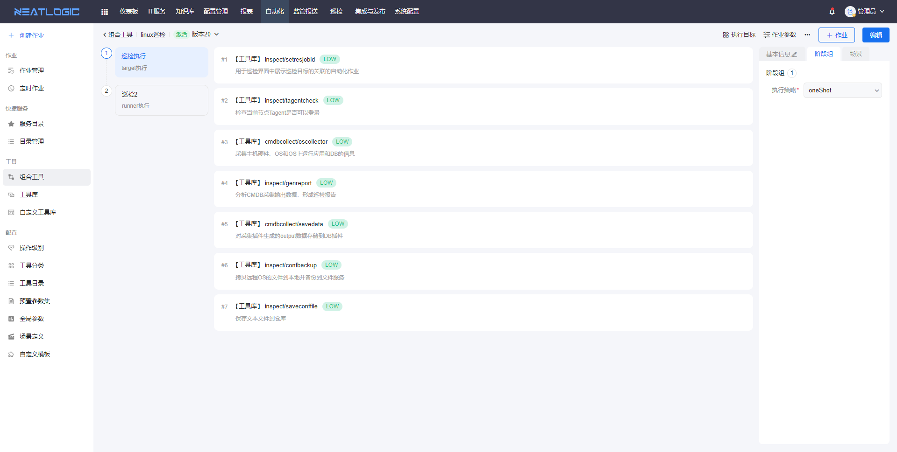
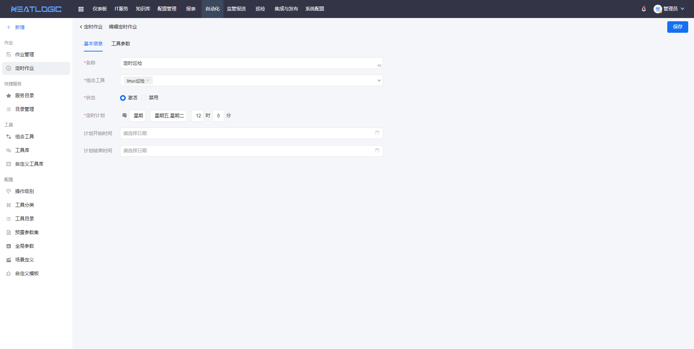
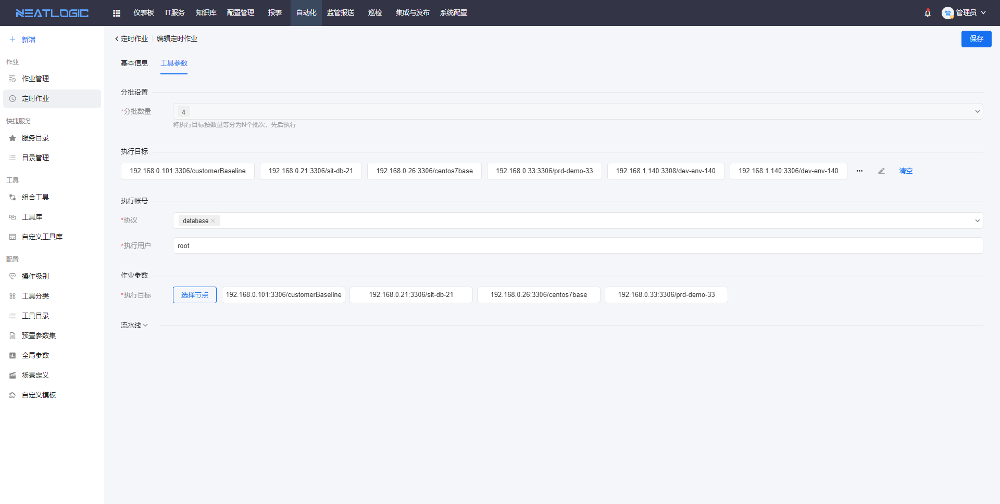

中文 / [English](README.en.md)

    

## 关于

neatlogic-autoexec自动化模块可以通过组合代码脚本实现场景一键自动化执行，例如MySQL数据库安装，模块包括自定义工具、组合工具、作业管理等功能。自动发布[neatlogic-deploy](../../../neatlogic-deploy/blob/develop3.0.0/README.md)
、巡检[neatlogic-inspect](../../../neatlogic-inspect/blob/develop3.0.0/README.md)
和配置管理[neatlogic-cmdb](../../../neatlogic-cmdb/blob/develop3.0.0/README.md)的自动发现功能，也使用了neatlogic-autoexec的基础能力。
neatlogic-autoexec不能单独部署，也不能单独构建，如需构建和部署，请参考[neatlogic-itom-all](../../../neatlogic-itom-all/blob/develop3.0.0/README.md)
的说明文档。

## 架构图

neatlogic-autoexec是自动化模块的管理平台，主要用于自动化作业的配置，执行还需要配合neatlogic-runner和[neatlogic-autoexec-backend](../../../neatlogic-autoexec-backend/blob/master/README.MD)
支持，[neatlogic-autoexec-scripts](../../../neatlogic-autoexec-scripts/blob/master/README.md)
则包含了大量原厂脚本，涵盖了安装数据库、复制虚拟机、灾备切换等复杂场景。

## 主要功能

### 工具

工具分为系统自带的工具和自定义工具两种，工具的执行方式支持本地执行（runner）和在目标机器执行（target、runner->target）。 

自定义工具内置多种脚本解析器，支持常用的脚本类型，如python、javascript、perl、sh等，支持定义输入和输入参数，参数值可配置默认值。

### 组合工具

基于工具和自定义工具的组合脚本，通过创建阶段框架，在阶段中添加工具并完成工具配置。

-支持定义作业参数，作业参数可被工具参数和执行目标引用
-支持在阶段或阶段组中预设执行目标，也可以预设整个作业的执行目标，阶段执行目标优先级更高

### 作业

作业执行方式有两种，包括手动发起作业和定时作业。
1. 在组合工具的基础上发起自动化作业

在作业管理页面，可根据需求过滤目标作业，并查看作业详情

2. 定时作业是通过“定时器+组合工具”的方式实现的。定时作业配置包括基本信息和工具参数两部分，基本信息的组合工具和定时计划决定作业的脚本和执行时间，工具参数则是提前预设好执行的一些参数，包括分批数量、执行目标、执行账号和作业参数等。

### 预置参数集

预置参数集可以关联一个或多个工具，参数将关联工具的输入参数合并为一个参数集合，支持提前配置参数值。

* 工具直接关联预置参数集，组合工具引用工具时，工具的配置默认启用关联预置参数集，工具的输入参数映射值默认为预置参数集配置。
  
* 工具未关联预置参数集，组合工具引用工具时，工具的配置默认关闭预置参数集。若启用关联预置参数集，可任意选择关联当前工具的预置参数集。
  